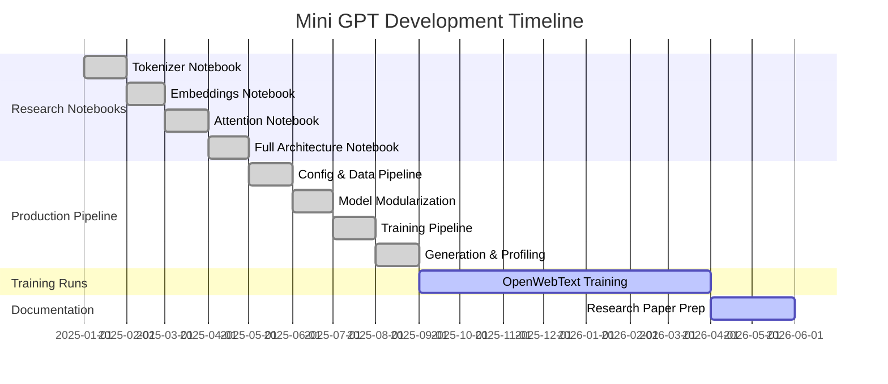

# Project Overview — Mini Generative Pretrained Transformer

## 1. Title

**Mini GPT: A Compact Decoder-Only Language Model Built From Scratch with Modern Transformer Components**

---

## 2. Abstract

This project implements a small-scale Generative Pretrained Transformer (GPT) entirely from scratch using PyTorch. The model follows a decoder-only architecture and incorporates several state-of-the-art design choices drawn from recent large language model (LLM) research, including Grouped-Query Attention (GQA), Rotary Positional Embeddings (RoPE), RMSNorm, and SwiGLU feed-forward blocks. The system is designed to train on commodity hardware (specifically an NVIDIA RTX 4060-class GPU) using memory-mapped data pipelines, cosine learning rate scheduling, and automatic checkpoint resume.

The project serves both as an educational deep-dive into modern transformer internals and as a practical, end-to-end reproducible training pipeline suitable for research experimentation.

---

## 3. Motivation

Large language models have transformed natural language processing, but their internal mechanics remain opaque to many practitioners. Commercial LLMs are trained on massive clusters with proprietary code, making it difficult to study individual architectural decisions in isolation.

This project addresses that gap by:

1. **Building every component from first principles** — tokenizer, embeddings, attention, normalization, feed-forward, and generation.
2. **Using modern (post-2023) architectural choices** rather than the original GPT-2 design, bringing the educational implementation closer to what production models actually use.
3. **Targeting consumer-grade hardware**, proving that meaningful experiments can be run on a single RTX 4060 with 8 GB VRAM.
4. **Providing a staged research notebook progression** (Tokenizer → Embeddings → Attention → Full Architecture) that mirrors how one would incrementally develop and validate an LLM.

---

## 4. Research Objectives

| # | Objective | Status |
|---|-----------|--------|
| 1 | Implement a byte-level BPE tokenizer from scratch and validate round-trip encoding/decoding | ✅ Complete |
| 2 | Train skip-gram with negative sampling (SGNS) embeddings as a warm-start for the transformer | ✅ Complete |
| 3 | Implement and compare four attention mechanisms: MHA, Causal MHA, MQA, and GQA | ✅ Complete |
| 4 | Build a full decoder-only transformer with RMSNorm, SwiGLU, RoPE, and weight tying | ✅ Complete |
| 5 | Create a production-ready training pipeline with memory-mapped data, checkpointing, and profiling | ✅ Complete |
| 6 | Train on the OpenWebText corpus and evaluate text generation quality | 🔄 In Progress |
| 7 | Document the entire system for research paper submission | 📄 This Document |

---

## 5. Scope

### In Scope

- Decoder-only autoregressive language modeling (GPT-style).
- Single-GPU training with mixed-precision (bfloat16).
- BPE tokenization with a 32,000-token vocabulary.
- Grouped-Query Attention as the primary attention mechanism.
- Cosine learning rate schedule with linear warmup.
- Periodic and best-validation checkpointing.
- PyTorch profiler integration for hardware performance analysis.
- Comprehensive research notebooks covering each subsystem.

### Out of Scope

- Multi-GPU / distributed training (no FSDP, DeepSpeed, or tensor parallelism).
- Reinforcement Learning from Human Feedback (RLHF) or instruction tuning.
- Deployment, serving, or quantization.
- Encoder-decoder architectures (though cross-attention is explored in notebooks).

---

## 6. Key Contributions

1. **A modular, readable codebase** where each file has a single responsibility (config, data, model, training, generation, tokenizer).
2. **A four-stage research notebook series** that builds understanding incrementally, from tokenization to full-scale training.
3. **Hardware-aware configuration profiles** that auto-adapt to CPU or RTX 4060, preventing out-of-memory errors.
4. **A streaming data pipeline** that reads parquet shards, tokenizes on the fly, and writes memory-mapped binaries — enabling arbitrarily large corpora without exhausting RAM.
5. **Integration of modern architectural primitives** (GQA, RoPE, RMSNorm, SwiGLU, weight tying) into a compact, self-contained codebase.

---

## 7. Technology Stack

| Category | Technology | Version / Details |
|----------|-----------|-------------------|
| Language | Python | 3.10+ |
| Deep Learning | PyTorch | ≥ 2.4.0 with CUDA 12.4 |
| Tokenization | HuggingFace `tokenizers` | ≥ 0.20.0 (Rust backend) |
| Data Format | Apache Parquet via `pyarrow` | ≥ 17.0.0 |
| Data Loading | NumPy `memmap` | Memory-mapped binary I/O |
| Profiling | PyTorch Profiler + Chrome Trace | Built-in |
| Notebooks | Jupyter | Research exploration |
| Hardware | NVIDIA RTX 4060 (8 GB VRAM) | Primary target |
| License | MIT | Open source |

---

## 8. Dataset

- **Primary corpus**: OpenWebText (Parquet shards, stored locally).
- **Research corpus**: *The Wonderful Wizard of Oz* (plain text, ~237 KB) — used for rapid prototyping in notebooks.
- **Tokenizer vocabulary**: 32,000 BPE tokens trained from a 100 MB sample of the corpus.
- **Data split**: 95% train / 5% validation (document-level random assignment).
- **Storage format**: `uint16` token ID binaries (`train.bin`, `val.bin`), read via `np.memmap`.

---

## 9. Model Summary

| Parameter | Value |
|-----------|-------|
| Architecture | Decoder-only Transformer |
| Embedding dimension | 768 |
| Transformer layers | 12 |
| Attention heads (query) | 12 |
| Key-Value heads (GQA) | 4 |
| FFN multiplier (SwiGLU) | 3.5× |
| Context length | 384 tokens |
| Vocabulary size | 32,000 |
| Dropout | 0.1 |
| Weight tying | Token embedding ↔ LM head |
| Trainable parameters | ~85M (estimated) |

---

## 10. Project Timeline & Milestones



---

## 11. Repository Structure

```
Mini_Generative_Pretrained_Transformer/
├── config.py              # All hyperparameters and paths
├── prepare_data.py        # Parquet → tokenized binaries
├── dataset.py             # Memory-mapped batch sampling
├── model.py               # GPT model (RMSNorm, SwiGLU, GQA, RoPE)
├── tokenizer.py           # BPE tokenizer wrapper (HuggingFace backend)
├── training.py            # Production training loop
├── generate.py            # Text generation from checkpoints
├── profiler_quickview.py  # Chrome trace summarizer
├── project_report.py      # Automated project health report
├── extract.py             # Legacy OpenWebText .xz extractor
├── train.py               # Legacy single-file training script
├── requirements.txt       # Python dependencies
├── wizard_of_oz.txt       # Research corpus
├── Research/              # Jupyter notebooks & artifacts
│   ├── Tokenizer.ipynb
│   ├── Embeddings.ipynb
│   ├── Attention.ipynb
│   ├── Full_Architecture.ipynb
│   ├── Small_Language_model.ipynb
│   └── *.md (walkthrough guides)
├── checkpoints/           # Training checkpoints (gitignored)
└── manuals/               # ← This documentation suite
```

---

## 12. Author

**Jeevant**  
License: MIT (see `LICENSE`)
