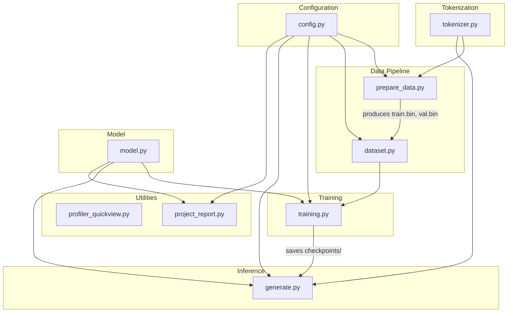
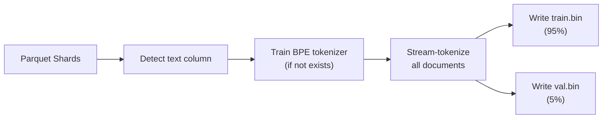
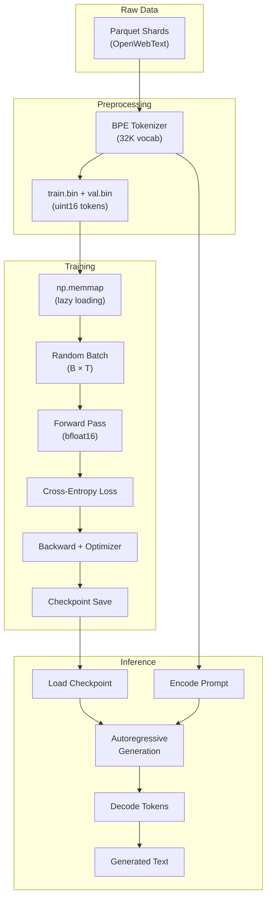

# Codebase Structure — Module Dependency Graph & Data Flow

## 1. Repository Layout

```
Mini_Generative_Pretrained_Transformer/
│
├── config.py                  # Central configuration (hyperparams, paths, device)
├── tokenizer.py               # BPE tokenizer (HuggingFace backend wrapper)
├── prepare_data.py            # Raw data → tokenized binary pipeline
├── dataset.py                 # Memory-mapped batch sampling
├── model.py                   # GPT model definition (all layers)
├── training.py                # Production training loop
├── generate.py                # Inference / text generation CLI
├── profiler_quickview.py      # Profiler trace analysis tool
├── project_report.py          # Automated project health report
│
├── extract.py                 # Legacy: OpenWebText .xz file extractor
├── train.py                   # Legacy: Single-file training script
├── app.py                     # Placeholder (unused)
│
├── requirements.txt           # Python dependency manifest
├── wizard_of_oz.txt           # Research corpus (~237 KB)
├── LICENSE                    # MIT License
├── .gitignore                 # Version control exclusions
│
├── Research/                  # Jupyter notebooks & research artifacts
│   ├── Tokenizer.ipynb        # Stage 1: BPE from scratch
│   ├── Embeddings.ipynb       # Stage 2: SGNS embeddings
│   ├── Attention.ipynb        # Stage 3: Attention variants
│   ├── Full_Architecture.ipynb# Stage 4: Full pipeline
│   ├── Small_Language_model.ipynb  # Early prototype notebook
│   ├── *.md                   # Walkthrough documents
│   ├── *.pt                   # Saved model artifacts
│   ├── *.json                 # Saved tokenizer artifacts
│   └── checkpoints_full_arch/ # Notebook checkpoint directory
│
├── checkpoints/               # Production training checkpoints (gitignored)
│   ├── ckpt_step_<N>.pt      # Periodic step checkpoints
│   └── best_model.pt         # Best validation loss checkpoint
│
└── manuals/                   # Documentation suite (this folder)
```

---

## 2. Module Dependency Graph



---

## 3. Module Responsibilities

### 3.1 `config.py` — Central Configuration Hub

**Role**: Single source of truth for all hyperparameters, file paths, and device settings.

**Key exports**:

| Variable | Value | Purpose |
|----------|-------|---------|
| `device` | `"cuda"` or `"cpu"` | Auto-detected compute device |
| `batch_size` | 20 | Training batch size |
| `block_size` | 384 | Context window length |
| `max_iters` | 300,000 | Total training steps |
| `learning_rate` | 2.5e-4 | Peak learning rate |
| `n_embd` | 768 | Model dimension |
| `n_layer` | 12 | Transformer depth |
| `n_head` | 12 | Query attention heads |
| `n_kv_heads` | 4 | Key-Value heads (GQA) |
| `vocab_size` | 32,000 | Tokenizer vocabulary |
| `TRAIN_BIN` | `"train.bin"` | Training data path |
| `VAL_BIN` | `"val.bin"` | Validation data path |
| `TOKENIZER_PATH` | `"bpe_tokenizer_32k.json"` | Tokenizer artifact |

**Design**: Uses `config` as a namespace module — all modules import `config` and read attributes directly. This avoids passing configuration through function arguments and keeps the interface simple.

---

### 3.2 `tokenizer.py` — BPE Tokenizer Wrapper

**Role**: Wraps the HuggingFace `tokenizers` Rust library into a clean Python API.

**Class**: `BytePairTokenizer`

**Key methods**:
- `train(data, vocab_size)` — Train BPE from text iterator
- `encode(text)` → `List[int]` — Text to token IDs
- `decode(ids)` → `str` — Token IDs to text
- `save(path)` / `load(path)` — Persistence

**Dependencies**: `tokenizers` library (Rust backend)

---

### 3.3 `prepare_data.py` — Data Preprocessing Pipeline

**Role**: Converts raw Parquet data files into tokenized binary files.

**Pipeline**:



**Key design decisions**:
1. **Streaming**: Documents are tokenized and written to disk one at a time — never loaded entirely into memory.
2. **Direct Parquet reading**: Uses `pyarrow.ParquetFile.read_row_group()` instead of HuggingFace `datasets`, avoiding large Arrow cache files.
3. **Automatic text column detection**: Tries `text`, `content`, `document`, `body` columns.
4. **EOS insertion**: Each document ends with an `<eos>` token to separate documents in the token stream.

---

### 3.4 `dataset.py` — Memory-Mapped Batch Sampling

**Role**: Provides random batch sampling from binary data files without loading them into RAM.

**Key function**: `get_batch(split) → (x, y)`

**Implementation details**:
1. Opens `train.bin` / `val.bin` as `np.memmap` (lazy memory-mapped access).
2. Generates `batch_size` random start positions.
3. Extracts contiguous windows of `block_size` tokens for input (`x`) and shifted-by-one targets (`y`).
4. Uses `pin_memory()` and `non_blocking=True` for efficient CPU→GPU transfer.

**Memory pattern**:
```
Data:    [t0, t1, t2, t3, t4, t5, t6, ...]
Input:   [t0, t1, t2, t3, t4]  (block_size=5)
Target:  [t1, t2, t3, t4, t5]  (shifted by 1)
```

---

### 3.5 `model.py` — GPT Language Model

**Role**: Defines the complete neural network architecture.

**Class hierarchy**:

```
GPTLanguageModel
├── token_embed: nn.Embedding(V, d)      # Token embeddings
├── blocks: nn.ModuleList                  # Transformer blocks × 12
│   └── TransformerBlock
│       ├── norm1: RMSNorm(d)             # Pre-attention norm
│       ├── attn: GroupedQueryAttention     # GQA module
│       │   ├── q_proj: Linear(d, d)      # Query projection
│       │   ├── k_proj: Linear(d, d_kv)   # Key projection
│       │   ├── v_proj: Linear(d, d_kv)   # Value projection
│       │   ├── o_proj: Linear(d, d)      # Output projection
│       │   └── rope: RotaryEmbedding      # RoPE
│       ├── norm2: RMSNorm(d)             # Pre-FFN norm
│       └── ffn: SwiGLU                    # Feed-forward block
│           ├── w1: Linear(d, h)          # Gate
│           ├── w2: Linear(d, h)          # Up projection
│           └── w_out: Linear(h, d)       # Down projection
├── norm_f: RMSNorm(d)                    # Final norm
└── lm_head: Linear(d, V)                # Output projection (tied)
```

---

### 3.6 `training.py` — Production Training Loop

**Role**: Orchestrates the full training procedure with validation, checkpointing, LR scheduling, and profiling.

**Key functions**:
- `train()` — Main training loop
- `estimate_loss(model, eval_iters)` — Evaluation on both splits
- `get_lr(step)` — Cosine LR with warmup
- `validate_training_setup()` — Pre-flight checks

---

### 3.7 `generate.py` — Text Generation CLI

**Role**: Loads a trained model and generates text from a user prompt.

**CLI interface**:
```
python generate.py --prompt "..." --max-tokens N --checkpoint path
```

---

### 3.8 `profiler_quickview.py` — Trace Analysis

**Role**: Parses PyTorch profiler Chrome traces and produces a human-readable performance summary.

**Outputs**: Top CPU ops, top GPU kernels, step timing statistics, automated performance tips.

---

### 3.9 `project_report.py` — Health Report

**Role**: Generates a comprehensive project status report including model parameters, data artifacts, checkpoints, and environment info.

---

## 4. End-to-End Data Flow



---

## 5. File Artifacts Produced

| Artifact | Producer | Consumer | Format |
|----------|----------|----------|--------|
| `bpe_tokenizer_32k.json` | `prepare_data.py` | `generate.py`, `prepare_data.py` | JSON |
| `train.bin` | `prepare_data.py` | `dataset.py` → `training.py` | Binary (uint16) |
| `val.bin` | `prepare_data.py` | `dataset.py` → `training.py` | Binary (uint16) |
| `ckpt_step_<N>.pt` | `training.py` | `training.py` (resume), `generate.py` | PyTorch dict |
| `best_model.pt` | `training.py` | `generate.py` | PyTorch dict |
| `performance_trace.json` | `training.py` (profiler) | `profiler_quickview.py` | Chrome trace |

---

## 6. Legacy vs. Production Files

| File | Status | Notes |
|------|--------|-------|
| `extract.py` | **Legacy** | Used for extracting `.xz` OpenWebText archives. Superseded by Parquet-based `prepare_data.py`. |
| `train.py` | **Legacy** | Original single-file training script. Superseded by modular `training.py`. |
| `app.py` | **Placeholder** | Empty file, not currently used. |
