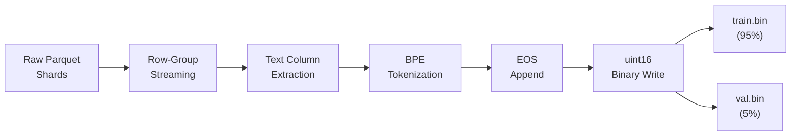

# Data Pipeline — Preprocessing, Tokenization, and Memory-Mapped I/O

## 1. Pipeline Overview

The data pipeline transforms raw text data into a format optimized for high-throughput GPU training. The design principle is **streaming**: data is processed incrementally and never held entirely in memory.



---

## 2. Input Data Format

### 2.1 Parquet Shards

The training corpus is stored as **Apache Parquet** files in a local directory:

```python
DATASET_PATH = r"D:\Openweb"
```

Parquet provides:
- **Columnar storage**: Only the text column is read; metadata and other columns are skipped.
- **Row-group granularity**: Files are read one row group at a time, keeping memory usage bounded.
- **Compression**: Snappy or ZSTD compression reduces disk I/O.

### 2.2 Text Column Auto-Detection

The pipeline automatically detects the text column by trying, in order:

1. `text`
2. `content`
3. `document`
4. `body`

If none match, it raises a `KeyError` with available column names.

### 2.3 Research Corpus

For rapid prototyping, the research notebooks use `wizard_of_oz.txt` (~237 KB, ~43,000 words). This is small enough for CPU-based experiments but large enough to demonstrate meaningful training dynamics.

---

## 3. Tokenizer Training

### 3.1 Conditional Training

The tokenizer is trained only if the artifact does not already exist:

```python
if not os.path.exists(TOKENIZER_PATH):
    # Train new tokenizer
else:
    # Load existing tokenizer
```

This prevents accidentally retraining the tokenizer (which would invalidate all existing data artifacts and checkpoints).

### 3.2 Training Data Sampling

The tokenizer is trained on a **100 MB subset** of the corpus, not the full dataset:

```python
SAMPLE_SIZE_MB = 100
```

This is sufficient for BPE to learn the most important merge rules. Training on the full dataset would take longer without significantly improving tokenizer quality.

### 3.3 Tokenizer Configuration

| Parameter | Value |
|-----------|-------|
| Algorithm | Byte-level BPE |
| Vocabulary size | 32,000 |
| Minimum merge frequency | 2 |
| Special tokens | `<pad>`, `<bos>`, `<eos>`, `<unk>` |
| Backend | HuggingFace `tokenizers` (Rust) |
| Output format | JSON |

---

## 4. Document Tokenization

### 4.1 Streaming Architecture

Documents are processed one at a time in a generator pipeline:

```python
for doc in iter_parquet_documents(parquet_files, text_column):
    tokens = tokenizer.encode(doc["text"])
    tokens.append(EOS_ID)
    arr = np.asarray(tokens, dtype=np.uint16)
    # Write to train or val file
```

**Why streaming matters**: For a large corpus (e.g., OpenWebText with ~8M documents and ~9B tokens), storing all token IDs in memory would require ~18 GB. Streaming writes them directly to disk.

### 4.2 Document Separation

Each document is terminated with an `<eos>` token:

```
[doc1_tokens...] <eos> [doc2_tokens...] <eos> [doc3_tokens...] <eos> ...
```

This allows the model to learn document boundaries. During training, the model may encounter batch windows that span document boundaries, which teaches it to handle context transitions naturally.

### 4.3 Train/Validation Split

Documents are randomly assigned to train (95%) or validation (5%) at the document level:

```python
if random.random() < VAL_PERCENT:  # VAL_PERCENT = 0.05
    val_f.write(arr.tobytes())
else:
    train_f.write(arr.tobytes())
```

This is a **document-level split**, not a token-level split. No document appears in both splits.

---

## 5. Binary Storage Format

### 5.1 Token Encoding

Token IDs are stored as **unsigned 16-bit integers** (`uint16` / `np.uint16`):

```python
arr = np.asarray(tokens, dtype=np.uint16)
```

- Maximum representable value: $2^{16} - 1 = 65{,}535$
- Vocabulary size: 32,000 → safely within uint16 range
- Bytes per token: 2

### 5.2 File Structure

The binary files have no header, no metadata, and no separators. They are simply a flat sequence of uint16 values:

```
[token_0][token_1][token_2]...[token_N]
  2 bytes  2 bytes  2 bytes     2 bytes
```

Total file size: $N_{tokens} \times 2$ bytes.

### 5.3 Token Count Calculation

```python
token_count = os.path.getsize(path) // 2  # uint16 = 2 bytes
```

---

## 6. Memory-Mapped Data Loading

### 6.1 What Is Memory Mapping?

`np.memmap` creates a file-backed array that is loaded lazily from disk. Only the pages actually accessed are read into RAM. The operating system manages caching transparently.

```python
data = np.memmap(config.TRAIN_BIN, dtype=np.uint16, mode="r")
```

### 6.2 Benefits

| Benefit | Explanation |
|---------|-------------|
| **Constant memory** | Only the current batch (~30 KB for B=20, T=384) is in memory |
| **No startup delay** | File is opened instantly; no full-file read |
| **OS-managed caching** | Frequently accessed regions stay in page cache |
| **Arbitrary dataset size** | Works with datasets larger than available RAM |

### 6.3 Batch Sampling

Random positions are sampled uniformly across the token stream:

```python
max_start = len(data) - config.block_size - 1
starts = np.random.randint(0, max_start + 1, size=config.batch_size, dtype=np.int64)
offsets = starts[:, None] + np.arange(config.block_size, dtype=np.int64)

x = torch.from_numpy(np.asarray(data[offsets], dtype=np.int64))
y = torch.from_numpy(np.asarray(data[offsets + 1], dtype=np.int64))
```

This produces:
- `x`: Input sequences of shape `(B, T)` — token IDs at positions $[i, i+T)$
- `y`: Target sequences of shape `(B, T)` — token IDs at positions $[i+1, i+T+1)$

### 6.4 GPU Transfer Optimization

```python
if "cuda" in str(config.device):
    x = x.pin_memory()
    y = y.pin_memory()

return x.to(config.device, non_blocking=True), y.to(config.device, non_blocking=True)
```

- **Pinned memory**: Allocated in non-pageable host memory for faster DMA transfer.
- **Non-blocking transfer**: CPU continues execution while data is transferred to GPU asynchronously.

---

## 7. Data Pipeline Validation

Before training starts, `validate_training_setup()` checks:

| Check | Condition |
|-------|-----------|
| Batch size | `batch_size > 0` |
| Block size | `block_size > 1` |
| Max iterations | `max_iters > 0` |
| Data files exist | `train.bin` and `val.bin` present |
| Sufficient data | Token count > `block_size + 1` for each split |

This prevents cryptic runtime errors from insufficient or missing data.

---

## 8. Scalability Analysis

### 8.1 What Scales

| Component | Scales With |
|-----------|------------|
| Preprocessing time | Corpus size (linear) |
| Disk space | Corpus size × 2 bytes/token |
| Training memory | Batch size × block size × model dim |
| Training time | max_iters × step time |

### 8.2 What Stays Constant

| Component | Fixed At |
|-----------|----------|
| Tokenizer training | 100 MB sample (capped) |
| Batch memory | ~30 KB per batch (before embedding) |
| File handles | 1 memmap per split |

### 8.3 Tested Scale

| Metric | Value |
|--------|-------|
| Corpus (research) | ~43K tokens (Wizard of Oz) |
| Corpus (production) | Millions of documents (OpenWebText) |
| Binary file size | Scales linearly — 1B tokens ≈ 2 GB |

---

## 9. Legacy Data Pipeline

The file `extract.py` is a legacy pipeline that:
1. Reads `.xz`-compressed OpenWebText archives.
2. Extracts text with parallel workers.
3. Writes to `output_train.txt` and `output_val.txt`.
4. Builds a character-level vocabulary.

This has been **fully superseded** by the Parquet-based `prepare_data.py` pipeline, which:
- Avoids decompression to intermediate text files.
- Uses BPE tokenization instead of character-level.
- Streams directly to binary format.
- Is significantly more memory-efficient.
