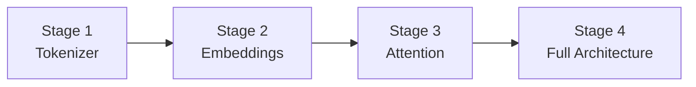
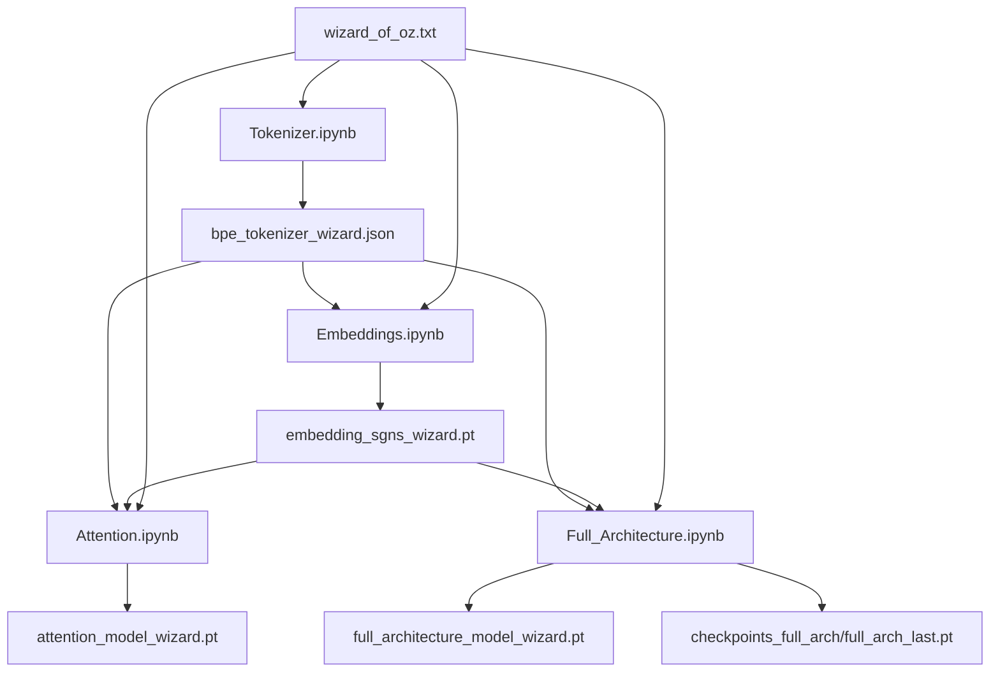

# Research Notebooks — Summary & Purpose

## 1. Notebook Progression

The research notebooks follow a staged curriculum that builds understanding incrementally:

Each notebook is self-contained but produces artifacts consumed by the next stage.

---

## 2. Notebook Inventory

### 2.1 `Research/Tokenizer.ipynb` — Stage 1: BPE From Scratch

**Purpose**: Build a byte-level BPE tokenizer from first principles.

**What it does**:
- Implements BPE training (merge learning from corpus frequencies).
- Implements encoding (text → token IDs) and decoding (token IDs → text).
- Handles special tokens (`<pad>`, `<bos>`, `<eos>`, `<unk>`).
- Validates round-trip accuracy and compression ratio.
- Saves artifact to `Research/bpe_tokenizer_wizard.json`.

**Corpus**: `wizard_of_oz.txt` (~237 KB).
**Vocab size**: 2,000 (small for fast iteration).

**Companion doc**: `Research/TOKENIZER_WALKTHROUGH.md`

---

### 2.2 `Research/Embeddings.ipynb` — Stage 2: SGNS Embeddings

**Purpose**: Train skip-gram with negative sampling (SGNS) embeddings from scratch.

**What it does**:
- Loads the trained BPE tokenizer from Stage 1.
- Encodes the corpus to token IDs.
- Builds skip-gram center-context pairs.
- Trains SGNS model with AdamW + optional AMP.
- Inspects nearest neighbors in embedding space.
- Exports `TokenAndPositionEmbedding` module for LLM use.
- Saves artifact to `Research/embedding_sgns_wizard.pt`.

**Training profiles**: `cpu_safe`, `cpu_quality`, `rtx_4060_balanced`, `rtx_4060_quality`, `rtx_4060_max`.

**Companion doc**: `Research/EMBEDDINGS_NOTEBOOK_ANALYSIS.md`

---

### 2.3 `Research/Attention.ipynb` — Stage 3: Attention Variants

**Purpose**: Implement and compare all major attention mechanisms.

**What it does**:
- Implements 5 attention variants: MHA, Causal MHA, MQA, GQA, Cross-Attention.
- Builds a complete Transformer block with RMSNorm, SwiGLU, RoPE.
- Loads pretrained embeddings from Stage 2.
- Trains a full autoregressive language model.
- Generates sample text from a prompt.
- Saves artifact to `Research/attention_model_wizard.pt`.

**Observed results** (cpu_safe profile):
- Parameters: ~2.52M
- Training loss: 8.13 → 4.13
- Validation loss: 8.13 → 4.26

**Companion docs**: `Research/ATTENTION_BEGINNER_GUIDE.md`, `Research/ATTENTION_NOTEBOOK_WALKTHROUGH.md`, `Research/ATTENTION_4060_TUNING.md`

---

### 2.4 `Research/Full_Architecture.ipynb` — Stage 4: Unified Pipeline

**Purpose**: Unify all stages into one end-to-end training pipeline with checkpoint resume.

**What it does**:
- Stage 1: Train or load BPE tokenizer.
- Stage 2: Train or load SGNS embeddings.
- Stage 3: Train Transformer LM with multi-stage curriculum.
- Stage 4: Generate text and export final model.
- Supports checkpoint resume for long training runs.
- Supports staged profile progression (e.g., balanced → quality).

**Controls**:
- `FORCE_RETRAIN_TOKENIZER` / `FORCE_RETRAIN_EMBEDDINGS`
- `ATTENTION_STAGE_PLAN` (list of profiles)
- `STAGE_STEP_SCALE` (training duration per stage)
- `RESUME_FROM_CHECKPOINT`

**Output artifact**: `Research/full_architecture_model_wizard.pt`

**Companion docs**: `Research/FULL_ARCHITECTURE_GUIDE.md`, `Research/GPU_NOTEBOOK_SETUP.md`

---

### 2.5 `Research/Small_Language_model.ipynb` — Early Prototype

**Purpose**: The original monolithic prototype notebook. Contains an earlier version of the training pipeline before modularization.

**Status**: Superseded by the staged notebook series and production pipeline. Kept for reference.

---

## 3. Artifact Dependency Graph

---

## 4. Research Artifacts Inventory

| Artifact | Size | Producer |
|----------|------|----------|
| `bpe_tokenizer_wizard.json` | ~86 KB | Tokenizer.ipynb |
| `embedding_sgns_wizard.pt` | ~2.0 MB | Embeddings.ipynb |
| `attention_model_wizard.pt` | ~9.6 MB | Attention.ipynb |
| `full_architecture_model_wizard.pt` | ~22.2 MB | Full_Architecture.ipynb |
| `checkpoints_full_arch/full_arch_last.pt` | ~66.8 MB | Full_Architecture.ipynb |
| `model-01.pt` | ~21.4 MB | Small_Language_model.ipynb |
| `model-01.pkl` | ~927 KB | Small_Language_model.ipynb |

---

## 5. Walkthrough Documents

| Document | Covers |
|----------|--------|
| `TOKENIZER_WALKTHROUGH.md` | Cell-by-cell tokenizer explanation, BPE internals, usage guide |
| `EMBEDDINGS_NOTEBOOK_ANALYSIS.md` | SGNS theory, complexity analysis, quality assessment, tuning |
| `ATTENTION_BEGINNER_GUIDE.md` | Beginner-friendly attention concepts |
| `ATTENTION_NOTEBOOK_WALKTHROUGH.md` | Cell-by-cell attention notebook breakdown |
| `ATTENTION_4060_TUNING.md` | RTX 4060 profiling and tuning guide |
| `FULL_ARCHITECTURE_GUIDE.md` | Full pipeline run modes, checkpoint resume, troubleshooting |
| `GPU_NOTEBOOK_SETUP.md` | CUDA environment setup for all notebooks |
