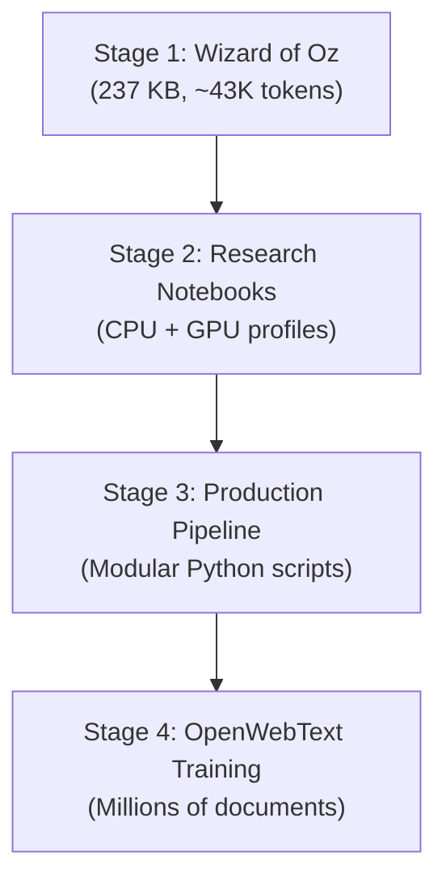

# Training Progression — From Wizard of Oz to OpenWebText

## 1. Staged Development Approach

This project follows a deliberate progression from small-scale experiments to production training:

---

## 2. Stage 1: Wizard of Oz Prototyping

**Purpose**: Validate end-to-end pipeline correctness before scaling.

| Parameter | Value |
|-----------|-------|
| Corpus | The Wonderful Wizard of Oz (single book) |
| Vocab size | 2,000 (research) |
| Model scale | ~2.5M parameters |
| Device | CPU |
| Training time | Minutes |

**Validated**: Tokenization, embedding training, attention mechanisms, generation.

---

## 3. Stage 2: Notebook Curriculum

Progressive model scaling through hardware-aware profiles:

| Profile | Device | Embedding Dim | Layers | Heads | Steps |
|---------|--------|--------------|--------|-------|-------|
| `cpu_safe` | CPU | 128 | 4 | 4 | 200 |
| `cpu_quality` | CPU | 192 | 6 | 6 | 400 |
| `rtx_4060_balanced` | GPU | 256 | 8 | 8 | 400 |
| `rtx_4060_quality` | GPU | 384 | 10 | 10 | 800 |
| `rtx_4060_max` | GPU | 512 | 12 | 12 | 1200 |

Each profile was tested and validated before moving to the next.

---

## 4. Stage 3: Production Pipeline

**Transition**: From notebook-based training to modular Python scripts.

Key changes from notebooks:
- Config centralized in `config.py` (not embedded in cells).
- Data pipeline reads Parquet directly (not HuggingFace datasets cache).
- Memory-mapped binary I/O (not in-memory tensors).
- Automatic checkpoint resume.
- Separate tokenizer, data, model, training, and generation modules.

Production model config:
- 768 dim, 12 layers, 12 heads, 4 KV heads (GQA)
- 32K vocabulary
- ~93M parameters

---

## 5. Stage 4: OpenWebText Training

**Current stage**: Training on the full OpenWebText corpus.

| Parameter | Value |
|-----------|-------|
| Corpus | OpenWebText (Parquet shards) |
| Vocab size | 32,000 |
| Training steps | 300,000 |
| Batch size | 20 |
| Context length | 384 |
| Tokens per step | 7,680 |
| Total tokens | ~2.3B |

---

## 6. Key Observations Across Stages

1. **Small-scale validation is essential**: Catching bugs on Wizard of Oz saved hours of GPU time.
2. **Profile-based scaling prevents OOM**: Gradual hardware adaptation was smoother than guessing.
3. **Modularization improved iteration speed**: Changing one component doesn't require re-running the full pipeline.
4. **Memory-mapped data was the key enabler**: Without it, OpenWebText would not fit on an RTX 4060 system.
